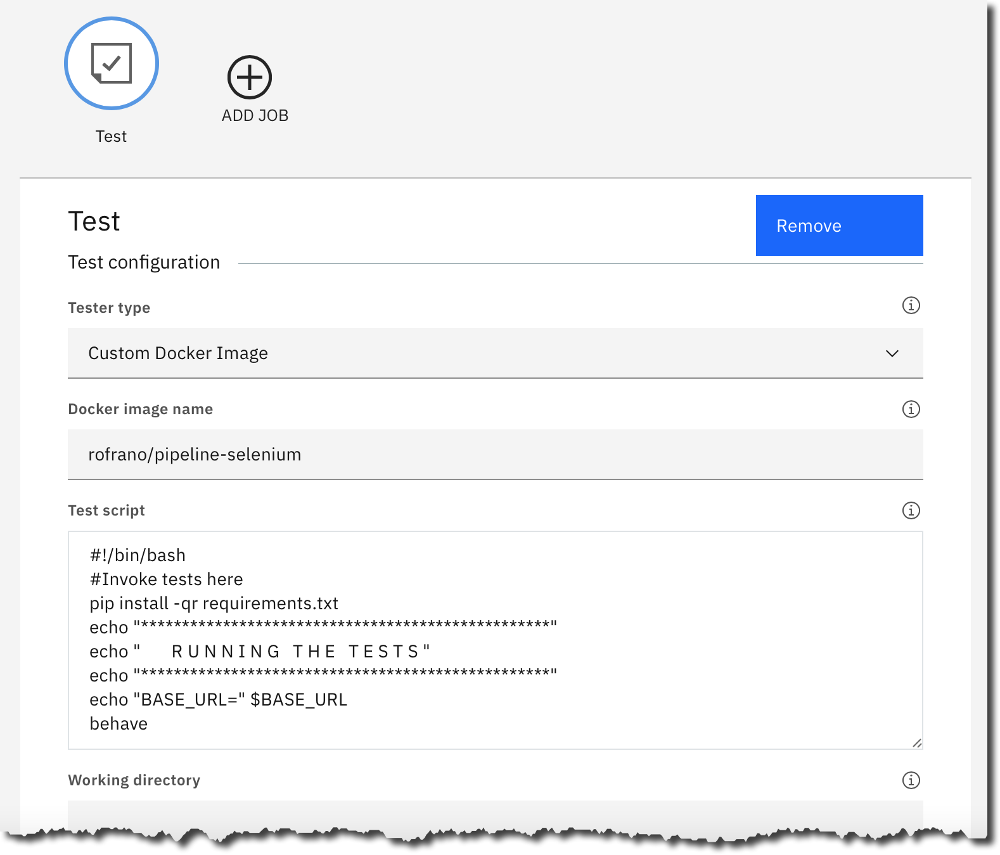

# Pipeline Selenium

[](https://github.com/rofrano/pipeline-selenium/actions)
[](https://opensource.org/licenses/Apache-2.0)

This Docker image is for Python Behavior Driven Development with Selenium, Chrome, and Firefox pre-installed.

## Description

This Docker image is based on the Python 3.11-Slim Debian 11 and contains Python 3 with Selenium and both the ChromeDriver and GeckoDriver to perform BDD testing with Behave with either headless Chrome or Firefox.

## Usage

You can use this Docker image as part of your IBM Cloud Continuous Delivery pipeline as a testing environment for your integration testing or you can use it stand-alone for testing locally.

### IBM Cloud Continuous Delivery

Create a Stage with a Test Job and select **Custom Docker Image** as the *Tester type* and supply `rofrano/pipline-selenium` as the *Docker image name* with the following script:

```bash
#!/bin/bash
#Invoke tests here
pipenv install --system --dev
echo "**************************************************"
echo "       R U N N I N G   T H E   T E S T S "
echo "**************************************************"
echo "BASE_URL=" $BASE_URL
behave
```

Your test job should look something like this:



### Local usage

To run locally use:

```sh
docker run --rm -it -h nyu --user vscode -v $(pwd):/app -w /app rofrano/pipeline-selenium bash
```

That will place you inside the container as the user `vscode` sitting at a `bash` prompt in the `/app` folder that has been shared with your current working directory so that you can `pipenv install` your dependencies and start your testing.

## License

Copyright (c) 2022, 2025 John Rofrano. All rights reserved.

Licensed under the Apache License. See [LICENSE](LICENSE)

This repository is part of the NYU graduate class **CSCI-GA.2810-001: DevOps and Agile Methodologies** taught by [John Rofrano](http://cs.nyu.edu/~rofrano/), Adjunct Instructor, NYU Courant Institute, Graduate Division, Computer Science.
